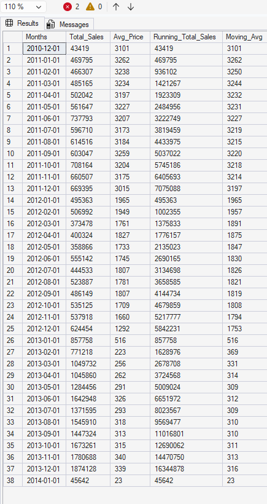
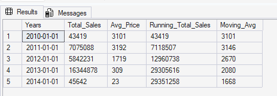
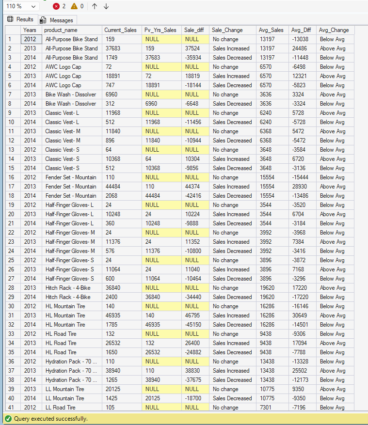
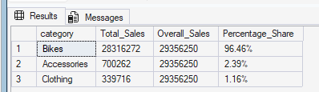
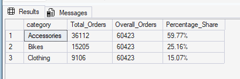
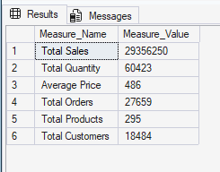
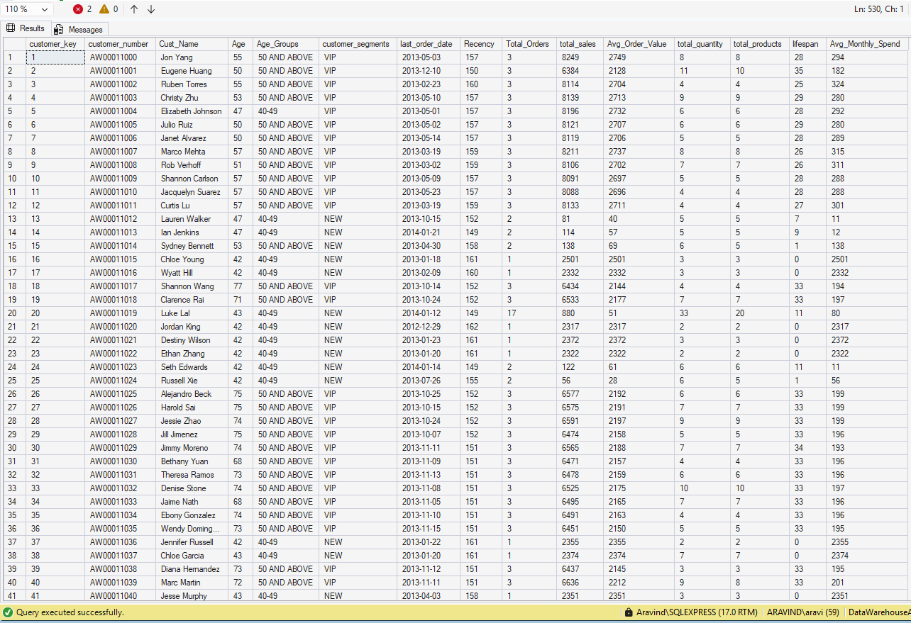
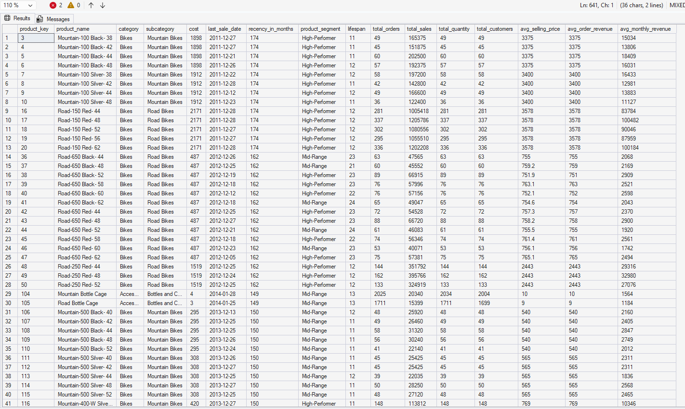

# Retail Sales Intelligence: SQL Analysis & Business Reporting

An end-to-end SQL analytics project covering the full analytical lifecycle — from exploratory data analysis through to customer segmentation, trend analysis, and consolidated business reporting views — using a retail sales dataset spanning 6 countries, 295 products, and 18,484 customers across a 4-year period.

---

## Dataset Overview

| Attribute | Detail |
|---|---|
| Tool | SQL Server (T-SQL) |
| Tables | `gold.fact_sales`, `gold.dim_customers`, `gold.dim_products` |
| Transactions | 60,398 |
| Customers | 18,484 |
| Products | 295 |
| Countries | 6 (US, Australia, UK, France, Germany, Canada) |
| Date Range | 2011 – 2014 |
| Total Revenue | $29,356,250 |
| Total Orders | 27,659 |

---

## Analytical Approach

The project follows a structured analytical arc across 7 stages:

### 1. Exploratory Data Analysis (EDA)
Database structure exploration, schema inspection, and initial measures — total sales, quantity, average price, order and customer counts.

### 2. Magnitude Analysis
Breakdown of customers and revenue by country, gender, product category, and subcategory to understand the shape of the business.

### 3. Ranking Analysis
Top and bottom performing products and subcategories by revenue, using both `TOP N` and `ROW_NUMBER()` window function approaches.

### 4. Cumulative Analysis
Monthly and yearly running totals using `SUM() OVER()` partitioned by year, alongside a moving average of price — tracking sales momentum over time.

**Monthly cumulative:**



**Yearly cumulative:**



### 5. Year-over-Year Performance Analysis
Product-level YoY comparison using `LAG()` to pull prior year sales, calculate the difference, and flag each product as Sales Increased / Sales Decreased / No Change. Also benchmarked against each product's historical average using `AVG() OVER()`.



### 6. Part-to-Whole Analysis
Category contribution to overall revenue and order volume using `SUM() OVER()` without partition — surfacing the dominance of Bikes (96.46% of revenue) and the high order share of Accessories (59.77%).

**By revenue:**



**By order volume:**



### 7. Customer & Product Segmentation
- **Product segmentation** by cost range (Below 100 / 100–500 / 500–1000 / Above 1000)
- **Customer segmentation** by spend behaviour and purchase history into VIP, Regular, and New cohorts

---

## Key Findings

| Metric | Value |
|---|---|
| Total Revenue | $29,356,250 |
| Bikes — Revenue Share | 96.46% |
| Accessories — Order Volume Share | 59.77% |
| VIP Customers (spend >$5K, tenure ≥12 months) | 1,653 |
| Regular Customers | 2,200 |
| New Customers (tenure <12 months) | 14,629 |
| Average Selling Price | $486 |



---

## Consolidated Report Views

The project culminates in two `CREATE VIEW` statements that serve as production-ready reporting layers:

### `gold.report_customers`
Multi-CTE view aggregating 10+ KPIs at the customer level:
- Customer segmentation (VIP / Regular / New)
- Age banding across 5 demographic groups (Below 20, 20–29, 30–39, 40–49, 50+)
- Recency (months since last order)
- Total orders, total sales, total quantity, total products
- Average Order Value (AOV)
- Average Monthly Spend
- Customer lifespan (months)



### `gold.report_products`
Multi-CTE view aggregating product-level KPIs:
- Product performance tier (High-Performer / Mid-Range / Low-Performer)
- Recency (months since last sale)
- Total orders, total sales, total quantity, total customers
- Average Selling Price
- Average Order Revenue (AOR)
- Average Monthly Revenue
- Product lifespan (months)



---

## SQL Techniques Used

- **Window Functions:** `LAG()`, `SUM() OVER()`, `AVG() OVER()`, `ROW_NUMBER()` with partitioning and ordering
- **Common Table Expressions (CTEs):** Multi-level CTEs for staged data transformation (`base_query → aggregation → final select`)
- **Joins:** `LEFT JOIN` across fact and dimension tables
- **Aggregations:** `SUM`, `COUNT DISTINCT`, `AVG`, `MIN`, `MAX`
- **Date Functions:** `DATEDIFF`, `DATETRUNC`, `YEAR()`, `MONTH()`, `FORMAT()`, `GETDATE()`
- **Conditional Logic:** `CASE WHEN` for segmentation and classification
- **Part-to-Whole:** `SUM() OVER()` without partition for percentage share calculations
- **CREATE VIEW:** Two consolidated reporting views as production-ready outputs

---

## Repository Structure

```
retail-sales-intelligence/
├── README.md
├── retail_sales_analysis.sql
├── key_metrics.png
├── cumulative_analysis_monthly.png
├── cumulative_analysis_yearly.png
├── yoy_performance.png
├── part_to_whole_sales.png
├── part_to_whole_orders.png
├── report_customers.png
└── report_products.png
```

---

## Tech Stack


---

## Author

**Aravind K Vijayakumar**  
Data Analyst | MSc Business Analytics, Aston University  
[LinkedIn](https://linkedin.com/in/aravindkvijayakumar) · [GitHub](https://github.com/Aravind-K-Vijayakumar)
